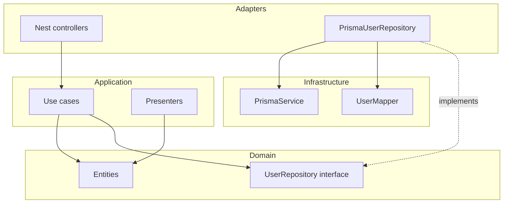

# Backend architecture (Sessionly Server)

This document describes how the NestJS backend is organized, following **Clean Architecture** and **DDD** ideas (layers, aggregates, ports and adapters), aligned with the layered boilerplate (`domain` → `application` → `infrastructure`, with shared `core`).

## Overview

The code is split into four main areas:

| Layer | Responsibility |
|--------|------------------|
| **Core** | Reusable, domain-neutral technical building blocks: base entity, identity, generic value objects, pagination types, **persistence mapping base (`Mapper`)**, global HTTP filters, and application errors. Does not know Nest or Prisma. |
| **Domain** | Rules and pure model: entities (e.g. `User`), business enums, **repository interfaces** (ports). No framework dependencies. |
| **Application** | Use cases, HTTP input/output DTOs, Nest controllers, **presenters** (domain → HTTP response mapping). Orchestrates the domain and depends only on abstractions (`UserRepository`, injection tokens). |
| **Infrastructure** | External details: **Prisma**, `PrismaService`, concrete repository implementations, **mappers** persistence ↔ domain. |

Dependency flow (rule): **Infrastructure** and **Application** depend on **Domain** and **Core**; **Domain** does not depend on **Application** or **Infrastructure**.

## Core

- **`Entity` / `UniqueEntityID` / `ValueObject`**: foundation for modeling aggregates and values with stable identity and comparison.
- **`Mapper<Domain, PersistenceRead, PersistenceWrite>`**: abstract mapping between domain and persistence; the third generic defaults to the read model when create/update payloads match the stored row. Infrastructure mappers extend this where it fits (e.g. `User` uses `Prisma.UserUpdateInput` for writes because the aggregate does not carry `passwordHash`).
- **Shared types**: pagination (`PaginationParams`, `PaginatedResult`), etc.
- **Filters and errors**: `HttpExceptionFilter` maps Nest exceptions and `AppError` to consistent HTTP responses.

## Domain

- **Entities** encapsulate business state and invariants (e.g. user with `ActivityStatus`).
- **Repositories** are **interfaces** (`UserRepository`) declared in the domain; implementation lives in infrastructure.
- **Injection tokens** (`USERS_REPOSITORY`) bind the interface to the implementation in the Nest module without coupling use cases to Prisma.

## Application

- **Use cases** (e.g. create user, list with pagination) are small classes with a main method (`execute`). They receive repositories via constructor using `@Inject(USERS_REPOSITORY)`.
- **DTOs** validate HTTP input (`class-validator`).
- **Controllers** only translate HTTP ↔ use case and shape the response (ideally via a presenter).
- **Presenters** (`UserPresenter.toHTTP`) ensure **internal fields are never exposed** (e.g. `passwordHash`).

## Infrastructure

Layout under `src/infrastructure/`:

| Path | Role |
|------|------|
| `database/prisma/prisma.module.ts` | Nest **connection module** only: registers global `PrismaService`. |
| `database/prisma/prisma.service.ts` | `PrismaClient` + lifecycle (`$connect` / `$disconnect`) and PostgreSQL adapter. |
| `database/prisma/prisma-repository.base.ts` | Shared helpers for Prisma repositories (e.g. `resolvePagination` using `PAGINATION_DEFAULT_TAKE` from config). |
| `database/repositories/` | Concrete adapters implementing domain ports (`PrismaUserRepository`). |
| `database/mappers/` | Persistence ↔ domain (`UserMapper`). |

- **`PrismaUserRepository`**: implements `UserRepository`, extends `PrismaRepositoryBase`, uses `PrismaService` and `UserMapper`.
- **`UserMapper`**: `toDomain` from Prisma rows; `toPersistence` maps the `User` aggregate to `Prisma.UserUpdateInput` (fields present on the domain model). **`toPrismaCreateInput`** builds `Prisma.UserCreateInput` from `CreateUserPersistenceInput`, because credentials are not part of the `User` entity—this keeps Prisma field names and null handling in one place.

## Persistence (Prisma)

**Two locations, one responsibility (persistence):**

1. **Repository root `prisma/`** — schema (`schema.prisma`), SQL migrations (`prisma/migrations/`), and datasource URL (`DATABASE_URL`). This is the canonical Prisma layout; treat schema and migration reviews as **infrastructure / persistence** work even though the folder is not under `src/`.
2. **`src/infrastructure/database/prisma/`** — Nest wiring around the generated client (`PrismaService`, `PrismaModule`).

- The generated client lives at `generated/prisma` (project root), per `schema.prisma` `output`, with `moduleFormat = "cjs"` for Nest’s CommonJS build.
- **Local development:** after changing the schema, run `npx prisma migrate dev` to create/apply migrations and regenerate the client; use `npx prisma generate` if you only need regeneration (also run on `postinstall`).
- **CI / production:** apply pending migrations with `npx prisma migrate deploy` (typically against `DATABASE_URL`); ensure the pipeline runs migrations before or alongside app startup.
- `DATABASE_URL` and migration credentials are owned by the environment (Docker Compose, CI secrets, production config).

## Nest modules

- **`AppModule`**: global configuration (`ConfigModule`) and feature module imports.
- **`UserModule`** (application): controllers and use cases.
- **`InfrastructureModule`**: composition root for **persistence adapters**—imports `PrismaModule`, registers concrete repositories and mappers, exports repository tokens for application modules.
- **`PrismaModule`** (`src/infrastructure/database/prisma/prisma.module.ts`): **connection-only** module (`@Global()`), exports `PrismaService` for repositories and any future Prisma-based adapters.

## HTTP contracts (current pattern)

Responses use an envelope with `message` and `data` to support evolution and stable client messages. Adjust copy in `src/core/response/response.messages.ts` if needed.

## Where to extend

- New bounded context: add entities and ports under `domain/`, use cases and controller under `application/<context>/`, Prisma repository and mapper under `src/infrastructure/database/repositories/` and `src/infrastructure/database/mappers/`, then register providers in `InfrastructureModule`.
- Domain events or queues: put interfaces in the domain and adapters in infrastructure.
